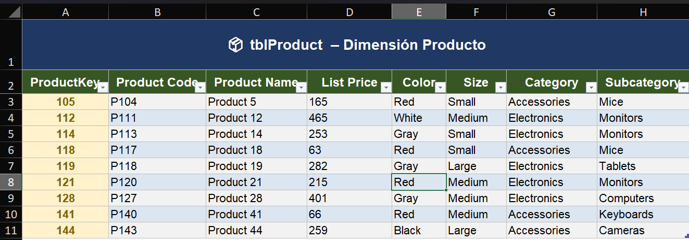
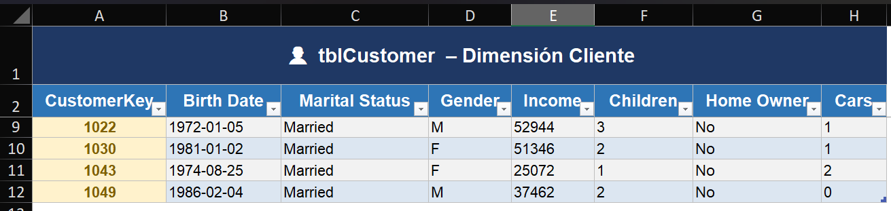
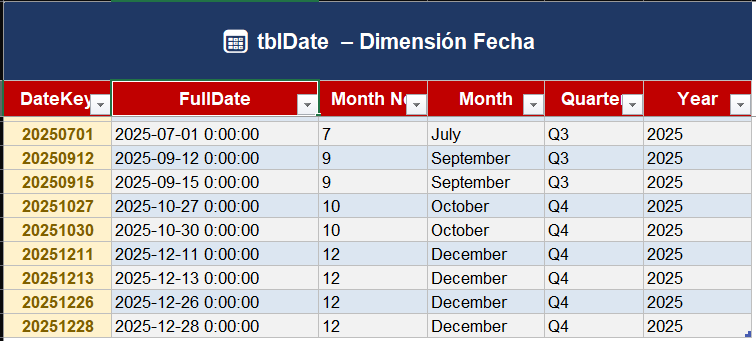
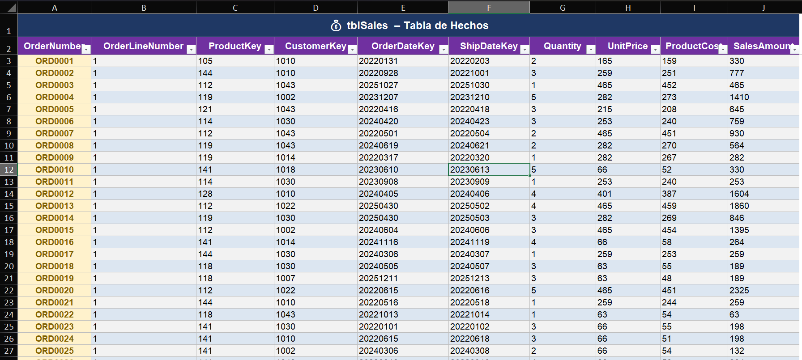
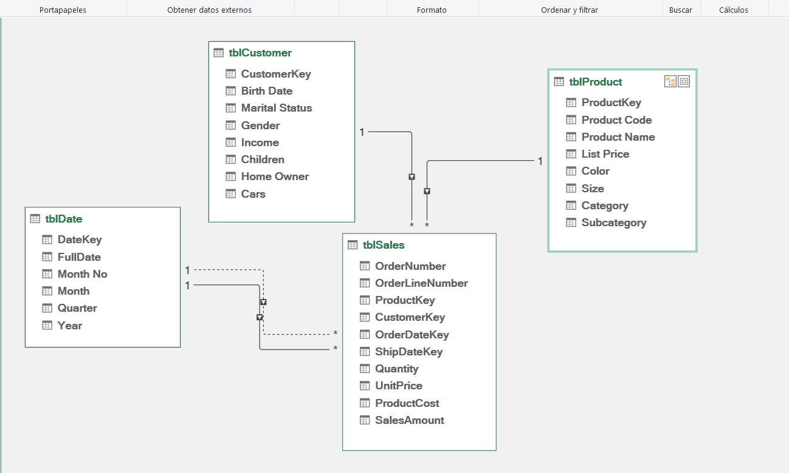
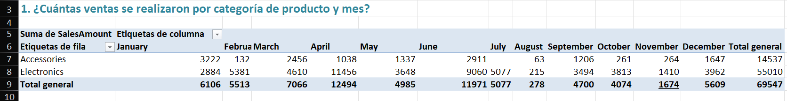
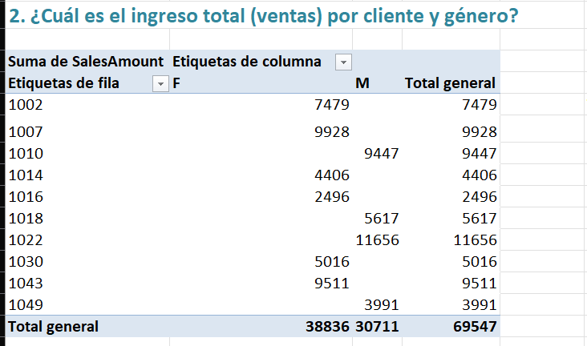
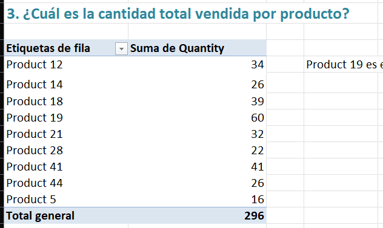
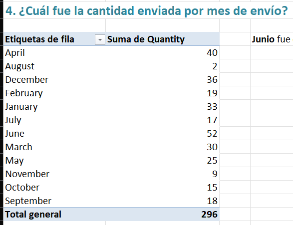
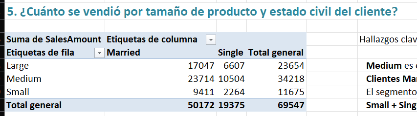

# ESCUELA POLITÉCNICA NACIONAL

## Facultad de Ingeniería de Sistemas

## Ingeniería de Software

## Business Intelligence

### Práctica #3

### Esquema Estrella con Power Pivot

**Integrantes:**
- Javier Angulo
- Jotcelyn Godoy
- Michael Tipan
- Javier Quilumba
- Cristian Robles

**Docente:** SILVIA DIANA MARTINEZ MOSQUERA

**Curso:** Business Intelligence / GR2SW

**Fecha:** 8 de Mayo de 2026

---

## Objetivos

Al finalizar esta práctica, se espera que el estudiante sea capaz de:

1. Identificar tablas de hechos y dimensiones a partir de una tabla desnormalizada.
2. Construir un esquema estrella en Excel con Power Pivot.
3. Crear relaciones entre tablas en el modelo de datos.
4. Responder preguntas de negocio mediante tablas dinámicas basadas en Power Pivot.

---

## Desarrollo de la práctica

### 1. Análisis de la tabla desnormalizada

Se partió de una tabla plana `Tabla_Desnormalizada_Ventas.xlsx` con **100 registros** y **26 columnas**, que combinaba información de ventas, productos, clientes y fechas en una sola hoja.

A partir de esta tabla se identificaron los siguientes componentes del esquema estrella:

| Componente | Tabla | Llave Primaria |
|---|---|---|
| Tabla de Hechos | `tblSales` | OrderNumber |
| Dimensión Producto | `tblProduct` | ProductKey |
| Dimensión Cliente | `tblCustomer` | CustomerKey |
| Dimensión Fecha | `tblDate` | DateKey |

---

### 2. Construcción del Esquema Estrella

Se creó un libro de Excel con una hoja por cada tabla. Cada rango fue convertido a **Tabla de Excel** con `Ctrl + T`, asignando el nombre correspondiente (`tblSales`, `tblProduct`, `tblCustomer`, `tblDate`).

#### 2.1 Dimensión Producto — `tblProduct`

Contiene **9 productos únicos** con sus atributos descriptivos. Los duplicados fueron eliminados usando la llave primaria `ProductKey`.

**Columnas:** ProductKey, Product Code, Product Name, List Price, Color, Size, Category, Subcategory.



---

#### 2.2 Dimensión Cliente — `tblCustomer`

Contiene **10 clientes únicos** con sus atributos demográficos. Los duplicados fueron eliminados usando la llave primaria `CustomerKey`.

**Columnas:** CustomerKey, Birth Date, Marital Status, Gender, Income, Children, Home Owner, Cars.



---

#### 2.3 Dimensión Fecha — `tblDate`

Contiene **147 fechas únicas**, generadas a partir de las fechas de orden y envío. Se agregaron columnas calculadas: Month No, Month, Quarter, Year para facilitar el análisis temporal.

**Columnas:** DateKey, FullDate, Month No, Month, Quarter, Year.



---

#### 2.4 Tabla de Hechos — `tblSales`

Contiene las **100 transacciones de venta** con las métricas del negocio y las llaves foráneas que la conectan con las dimensiones.

**Columnas:** OrderNumber, OrderLineNumber, ProductKey, CustomerKey, OrderDateKey, ShipDateKey, Quantity, UnitPrice, ProductCost, SalesAmount.



---

### 3. Carga y relaciones en Power Pivot

Cada tabla fue cargada al modelo de datos mediante **Power Pivot → Agregar al modelo de datos**. Luego, en la **Vista de Diagrama**, se establecieron las siguientes relaciones:

| Tabla de Hechos | Llave Foránea | Dimensión | Llave Primaria | Estado |
|---|---|---|---|---|
| tblSales | ProductKey | tblProduct | ProductKey | ✅ Activa |
| tblSales | CustomerKey | tblCustomer | CustomerKey | ✅ Activa |
| tblSales | OrderDateKey | tblDate | DateKey | ✅ Activa |
| tblSales | ShipDateKey | tblDate | DateKey | ⚪ Inactiva |

> La relación con `ShipDateKey` queda inactiva automáticamente porque ya existe una relación activa entre `tblSales` y `tblDate`. Para activarla se requiere la función DAX `USERELATIONSHIP`.



---

### 4. Tablas dinámicas — Preguntas de negocio

Para responder cada pregunta se insertó una tabla dinámica seleccionando **"Usar el modelo de datos de este libro"**, permitiendo cruzar campos de distintas tablas a través de las relaciones definidas en Power Pivot.

---

#### Pregunta 1 — ¿Cuántas ventas se realizaron por categoría de producto y mes?

**Configuración:**
- Filas: `tblProduct → Category`
- Columnas: `tblDate → Month`
- Valores: `tblSales → SalesAmount (Suma)`



**Análisis:** La categoría **Electronics** domina las ventas con **$55,010 (79%)** del total de **$69,547**. El mes con mayor actividad fue **April con $12,494**, mientras que **August** registró el menor volumen con apenas **$278**. La categoría **Accessories** alcanzó **$14,537** concentrándose principalmente en January y June.

---

#### Pregunta 2 — ¿Cuál es el ingreso total por cliente y género?

**Configuración:**
- Filas: `tblCustomer → CustomerKey`
- Columnas: `tblCustomer → Gender`
- Valores: `tblSales → SalesAmount (Suma)`



**Análisis:** Las clientes de **género Femenino (F)** generaron **$38,836 (56%)** del ingreso total, superando a los clientes Masculinos con **$30,711 (44%)**. El cliente con mayor ingreso individual fue **1022 (M) con $11,656**, seguido de **1007 (F) con $9,928** y **1043 (F) con $9,511**.

---

#### Pregunta 3 — ¿Cuál es la cantidad total vendida por producto?

**Configuración:**
- Filas: `tblProduct → Product Name`
- Valores: `tblSales → Quantity (Suma)`



**Análisis:** **Product 19** fue el producto más vendido con **60 unidades (20%)** del total de **296 unidades**. Le siguieron **Product 41 con 41** y **Product 12 con 34** unidades. El producto de menor volumen fue **Product 5 con solo 16 unidades**.

---

#### Pregunta 4 — ¿Cuál fue la cantidad enviada por mes de envío?

**Configuración:**
- Filas: `tblDate → Month`
- Valores: `tblSales → Quantity (Suma)`

> Para usar la fecha de envío correctamente se puede aplicar la medida DAX:
> ```
> Qty Enviada:=CALCULATE(SUM(tblSales[Quantity]),USERELATIONSHIP(tblSales[ShipDateKey],tblDate[DateKey]))
> ```



**Análisis:** **June** fue el mes con mayor cantidad enviada con **52 unidades**, seguido de **April con 40** y **December con 36**. El mes de menor envío fue **August con apenas 2 unidades**, lo que sugiere una baja operativa en ese período.

---

#### Pregunta 5 — ¿Cuánto se vendió por tamaño de producto y estado civil del cliente?

**Configuración:**
- Filas: `tblProduct → Size`
- Columnas: `tblCustomer → Marital Status`
- Valores: `tblSales → SalesAmount (Suma)`



**Análisis:** Los productos de tamaño **Medium** fueron los más vendidos con **$34,218 (49%)** del total. Los clientes **Married dominaron** en todos los tamaños con **$50,172 (72%)** frente a **$19,375 (28%)** de clientes Single. El segmento más fuerte fue **Medium + Married con $23,714**, mientras que el más débil fue **Small + Single con $2,264**.

---

## Conclusiones

1. La transformación de una tabla desnormalizada a un esquema estrella permite organizar los datos de forma eficiente para el análisis, separando métricas (hechos) de atributos descriptivos (dimensiones).

2. Power Pivot facilita la creación de relaciones entre tablas sin duplicar datos, logrando un modelo compacto con 100 transacciones distribuidas en 4 tablas relacionadas.

3. El uso de tablas dinámicas sobre el modelo de datos permite cruzar información de múltiples dimensiones en segundos, respondiendo preguntas de negocio complejas con pocos clics.

4. **Electronics** es la categoría estratégica del negocio representando el 79% de las ventas, y el segmento **Medium + Married** es el perfil de cliente más rentable.

5. La relación inactiva con `ShipDateKey` demuestra la importancia de la función DAX `USERELATIONSHIP` para análisis temporales alternativos dentro del mismo modelo.