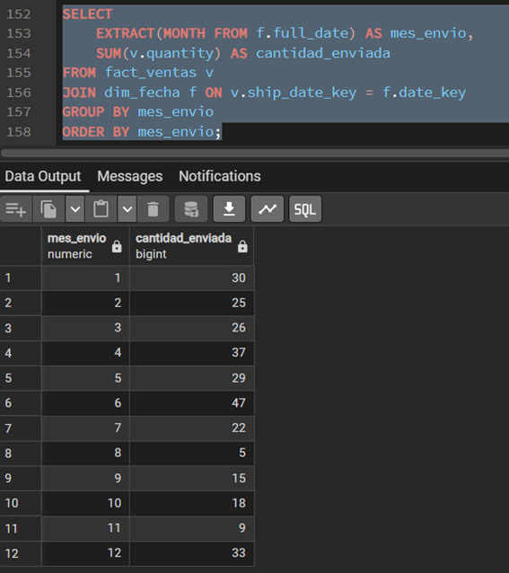
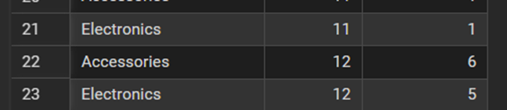
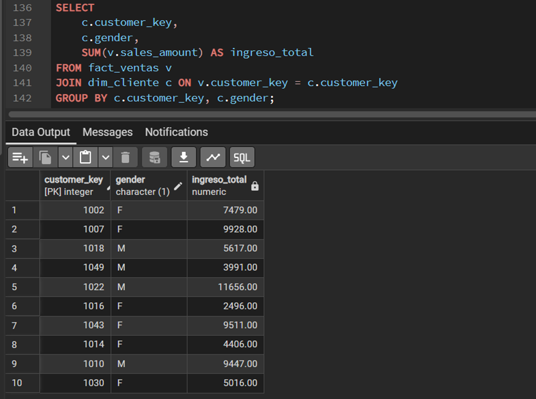
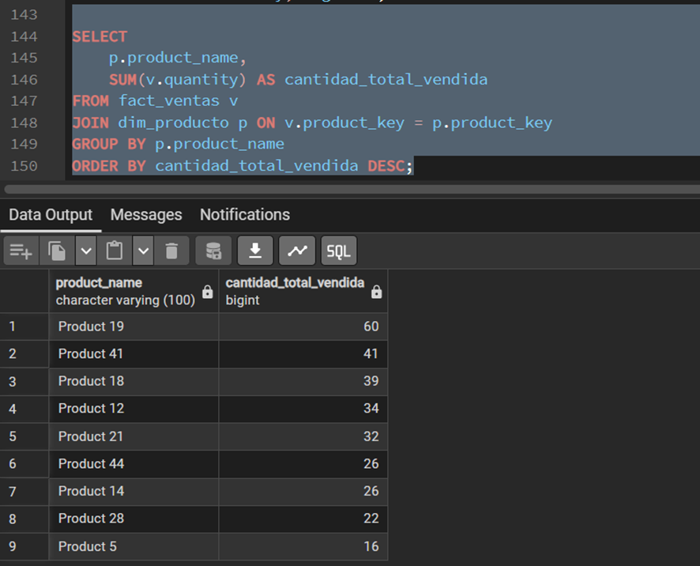

# ESCUELA POLITÉCNICA NACIONAL
# Facultad de Ingeniería de Sistemas
# Ingeniería de Software
# Business Intelligence

## Práctica #4
### Modelo conceptual lógico físico estrella
**Integrantes:**
* Javier Angulo
* Jotcelyn Godoy
* Michael Tipan
* Javier Quilumba
* Cristian Robles

**Docente:**
SILVIA DIANA MARTINEZ MOSQUERA

**Curso:**
Business Intelligence / GR2SW

**Fecha:**
5 de Mayo de 2026

---

## Objetivos

Al finalizar esta práctica, se espera que el estudiante sea capaz de:

1. Normalizar datos en un esquema estrella. 
2. Realizar la implementación del modelo físico estrella PostgreSQL.

---

## Desarrollo de la práctica

1. Introducción
Este informe detalla el proceso de normalización de datos en un esquema estrella y la implementación de consultas SQL para el análisis de ventas. Se trabajó con archivos de productos y ventas desnormalizadas para estructurar un modelo eficiente de BI.

## 2. Diagramas del Modelo Estrella (Power Pivot)

### 2.1. Modelo Estrella: Catálogo de Productos
Este diagrama representa la estructura de las tablas `fact_products`, `dim_category` y `dim_subcategory`.


### 2.2. Modelo Estrella: Ventas (Tabla Desnormalizada)
Normalización de los datos del archivo `Tabla_Desnormalizada_Ventas.csv` en un esquema estrella para facilitar el análisis transaccional.


---

## 3. Resolución de Preguntas SQL
A continuación, se presentan las consultas SQL solicitadas para el análisis de los datos:

### 1. ¿Cuántas ventas se realizaron por categoría de producto y mes?

```sql
SELECT 
    p.category, 
    EXTRACT(MONTH FROM f.full_date) AS mes, 
    COUNT(*) AS total_ventas
FROM fact_ventas v
JOIN dim_producto p ON v.product_key = p.product_key
JOIN dim_fecha f ON v.order_date_key = f.date_key
GROUP BY p.category, mes
ORDER BY mes;
```






### 2. ¿Cuál es el ingreso total (ventas) por cliente y género?
```sql
SELECT 
    c.customer_key, 
    c.gender, 
    SUM(v.sales_amount) AS ingreso_total
FROM fact_ventas v
JOIN dim_cliente c ON v.customer_key = c.customer_key
GROUP BY c.customer_key, c.gender;
```




### 3. ¿Cuál es la cantidad total vendida por producto?
```sql
SELECT 
    p.product_name, 
    SUM(v.quantity) AS cantidad_total_vendida
FROM fact_ventas v
JOIN dim_producto p ON v.product_key = p.product_key
GROUP BY p.product_name
ORDER BY cantidad_total_vendida DESC;
```


### 4. ¿Cuál fue la cantidad enviada por mes de envío?
```sql
SELECT 
    EXTRACT(MONTH FROM f.full_date) AS mes_envio, 
    SUM(v.quantity) AS cantidad_enviada
FROM fact_ventas v
JOIN dim_fecha f ON v.ship_date_key = f.date_key
GROUP BY mes_envio
ORDER BY mes_envio;
```


### 5. ¿Cuánto se vendió por tamaño de producto y por estado civil del cliente?
```sql
SELECT 
    p.size, 
    c.marital_status, 
    SUM(v.sales_amount) AS total_vendido
FROM fact_ventas v
JOIN dim_producto p ON v.product_key = p.product_key
JOIN dim_cliente c ON v.customer_key = c.customer_key
GROUP BY p.size, c.marital_status;
```


