# ESCUELA POLITÉCNICA NACIONAL
# Facultad de Ingeniería de Sistemas
# Ingeniería de Software
# Business Intelligence

## Laboratorio #1
### Instalación y uso de Pentaho Data Integration (PDI)

**Integrantes:**
* Javier Angulo
* Jotcelyn Godoy
* Michael Tipan
* Javier Quilumba
* Cristian Robles

**Docente:**
Diana

**Curso:**
Business Intelligence / GR2SW

**Fecha:**
21 de abril de 2026

---

## INTRODUCCIÓN

---

## DESARROLLO

# Caso 1 - Proceso ETL (JSON Input → Number Range → JSON Output)
**Responsable:** Cristian Robles

### 1. Fase de Extracción (E)
Para iniciar el proceso, se preparó la fuente de datos y la conexión inicial en PDI:
- **Preparación del origen:** Se creó un archivo `.json` local con una estructura jerárquica de usuarios y encuestas.
- **Configuración del Input:** Se utilizó el step **JSON Input** (renombrado como *Staging*). Se mapearon los campos mediante **JsonPath** para transformar la estructura anidada en una tabla lógica de Pentaho.

### 2. Fase de Transformación (T)
El objetivo fue enriquecer los datos originales mediante una calificación cualitativa basada en valores numéricos.
- **Lógica de Negocio:** Se integró el step **Number Range** para clasificar el campo `puntuacion_satisfaccion`.
- **Umbrales definidos:**
  | Límite Inferior | Límite Superior | Valor Cualitativo |
  |-----------------|-----------------|-------------------|
  | 0.0             | 5.0             | Baja              |
  | 5.0             | 8.0             | Media             |
  | 8.0             | 10.0            | Alta              |

### 3. Fase de Carga (L)
Finalmente, los datos transformados se exportaron para su consumo posterior.
- **Configuración de Salida:** Se utilizó el step **JSON Output** conectado a la salida del step de transformación.
- **Definición de Campos:** Se especificó el directorio de destino y se seleccionaron los campos originales junto con el nuevo campo calculado `rango`.

### 4. Ejecución y Validación
- **Ejecución:** Se corrió la transformación mediante el botón **Run**.
- **Verificación:** Se revisaron los logs de ejecución de Spoon para confirmar el éxito (`I=5, O=5`) y se validó físicamente que el archivo JSON de salida contuviera la nueva etiqueta cualitativa.

---

# Caso 2 - Proceso ETL (Data Grid → String Operations → Text file Output)
**Responsables:** Michael Tipan / Jotcelyn Godoy

### 1. Fase de Extracción (E)
- **Configuración:** Se utilizó el componente **Data Grid** para generar una tabla de datos interna. Se definió la columna `Nombre` de tipo String.
  /image.png>)
- **Datos ingresados:** Se registraron 5 filas con nombres propios (Cristian, Javier, Juan, Pedro y Pepito).
  /image-1.png>)

### 2. Fase de Transformación (T)
- **Operación:** Se aplicó el componente **String Operations** para la normalización de cadenas de texto.
- **Configuración:** Se seleccionó el campo `Nombre`, aplicando la función **Upper** (Mayúsculas) y **Trim type: both** para eliminar espacios en blanco innecesarios.
  /image-2.png>)

### 3. Fase de Carga (L)
- **Función:** Exportar los datos ya transformados a un archivo físico.
- **Resultado:** Se utilizó el componente **Text File Output** para generar el archivo final con los nombres estandarizados.
  /image-3.png>)

### 4. Ejecución y Validación
- **Estado:** Finalización exitosa verificada mediante checks verdes en todos los componentes y procesamiento correcto de las 5 filas de entrada.
  /image-4.png>)
  /image-5.png>)
  /image-6.png>)

---

# Caso 3 - Proceso ETL (CSV Input → Calculator → JSON Output)
**Responsable:** Jonathan Tipan

### 1. Fase de Extracción (E)
- **Origen:** Se trabajó con un archivo de ventas en formato `.csv` (`ventas.csv`).
  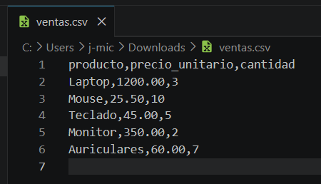
- **Configuración:** Se configuró el step **CSV File Input** con delimitador `,` y la opción **Header row present** activada, detectando los campos automáticamente.
  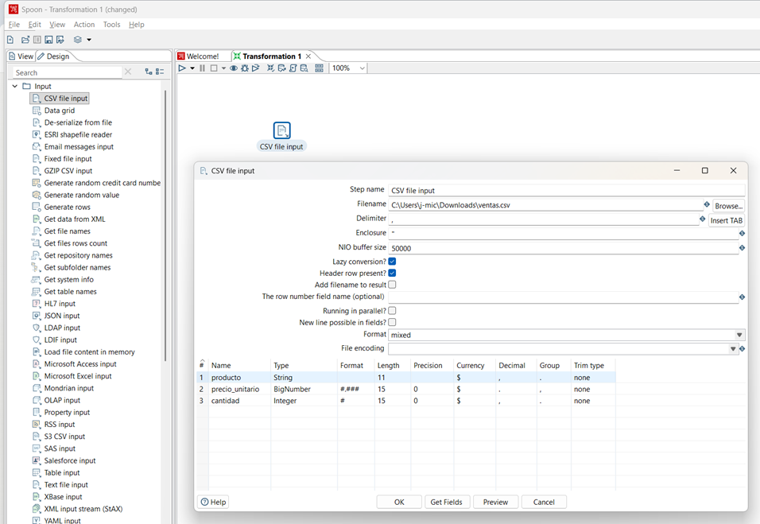

### 2. Fase de Transformación (T)
- **Lógica:** Se implementó el step **Calculator** para calcular el subtotal de cada producto.
- **Operación:** Se definió el campo `subtotal` mediante la multiplicación: `precio_unitario * cantidad`.
  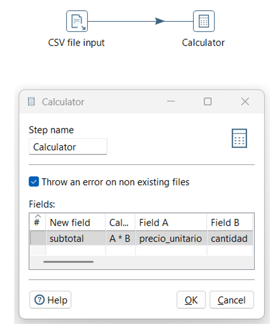

### 3. Fase de Carga (L)
- **Configuración:** Uso del step **JSON Output** configurado como `Write to file` y codificación **UTF-8**.
- **Campos:** Se incluyeron mediante **Get Fields** las columnas originales y el nuevo cálculo de subtotal.
  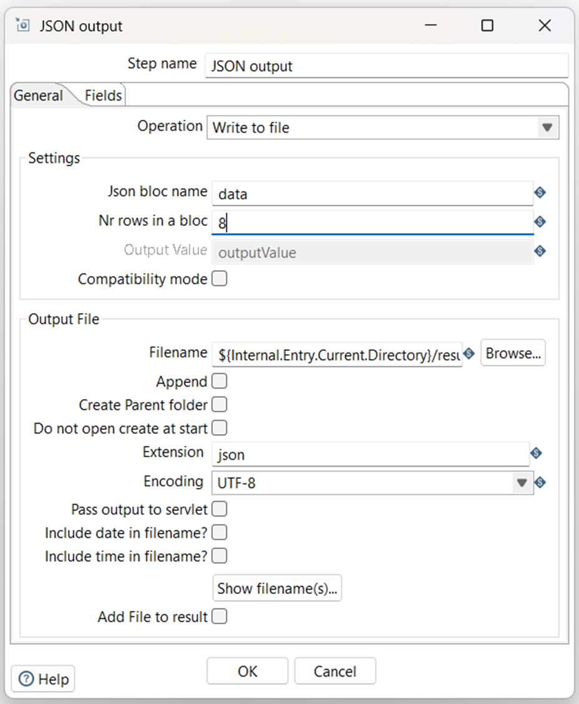
  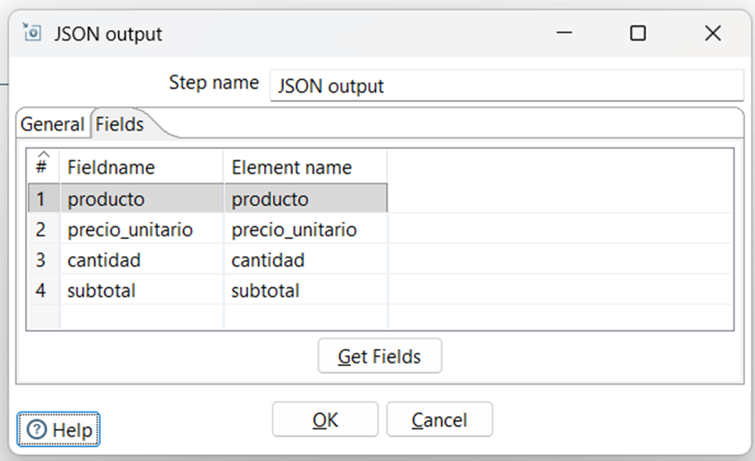

### 4. Ejecución y Validación
- **Resultado:** El proceso finalizó correctamente generando el archivo `resultados_0.json`.
  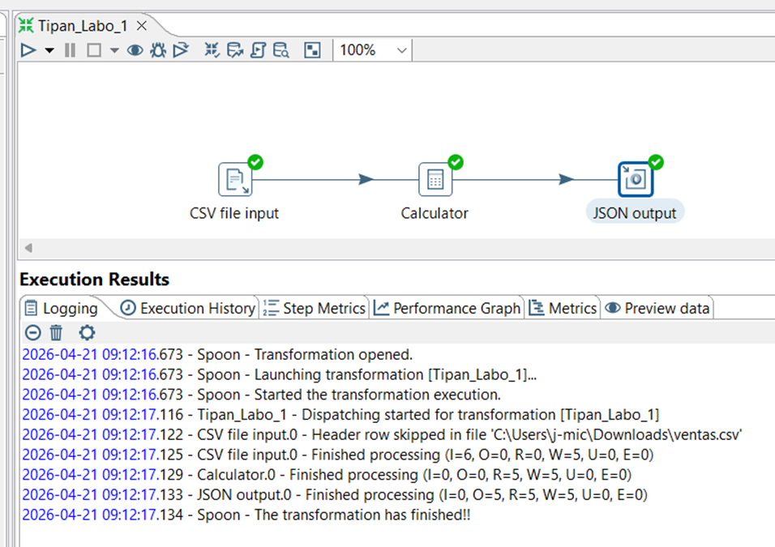
  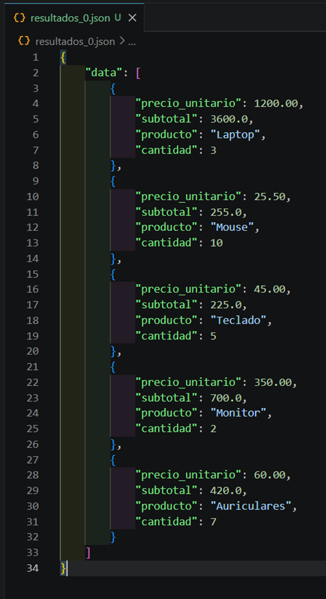

---

# Caso 4 - Proceso ETL en Pentaho (XML → Row denormaliser → CSV)

## 1. Extracción (E)

Se utilizó un archivo XML obtenido del dataset de W3Schools XML Simple Dataset ([https://www.w3schools.com/xml/simple.xml](https://www.w3schools.com/xml/simple.xml)), el cual contiene nodos `<food>` con datos como nombre, precio, descripción y calorías.

* Step usado: **Get Data from XML** (*Staging*)
* Loop XPath: `/breakfast_menu/food`
* Campos extraídos: `name`, `price`, `description`, `calories`


## 2. Transformación (T)

Se aplicaron operaciones básicas de limpieza y estructuración:

* **String Operations (Trim)**: eliminación de espacios en campos de texto. Se aplicó la operación Trim (both) a los campos de tipo texto (name, description, price) para eliminar espacios en blanco al inicio y final de cada valor.


* **Row Denormaliser**: adaptación de la estructura jerárquica a formato tabular. Este paso permitió reorganizar los datos provenientes del XML en una estructura tabular más adecuada para exportación, agrupando valores relacionados en una sola fila cuando era necesario,ya que la jerarquia comun de XML no permite su transformacion a archivos planos como CSV.


  

## 3. Carga (L)

Los datos se exportaron a formato plano:

* Step: **Text File Output (CSV)**
* Separador: coma (`,`)
* Campos: `name`, `price`, `description`, `calories`


## 4. Validación

- Se validó que el archivo CSV generado contuviera los datos correctamente limpiados,no contuviera espacios en blanco y que estos estuvieran estructurados en formato tabular.

- Se comprobó que cada registro del XML original correspondiera a una fila en el archivo CSV final.


# Caso 5 - Proceso ETL (YAML Input → JS Value → Table Output)
<div style="background-color: #f4f6f8; border-left: 4px solid #1a73e8; padding: 15px; border-radius: 4px; font-family: sans-serif;">
  <b style="color: #1a73e8;">Contexto y Propuesta:</b><br/>
  Implementación de un flujo de Extracción, Transformación y Carga (ETL) orientado a procesar remesas de catálogos nativos de integraciones API (YAML), aplicar reglas de negocio sobre métricas comerciales mediante algoritmos, y consolidar los registros resultantes en una tabla de Staging dentro de un motor relacional embebido.
</div>

<br/>

#### Arquitectura del Flujo y Nodos de Operación

A continuación, se fundamenta rigurosamente el diseño de las etapas vectoriales. El proceso abarca la lectura transaccional, el procesado Rhino nativo intermedio y la carga bajo directrices relacionales:

<table style="width: 100%; border-collapse: collapse; font-family: sans-serif; font-size: 0.95em;">
  <thead style="background-color: #1a73e8;">
    <tr>
      <th style="padding: 10px; border: 1px solid #e0e0e0; text-align: left; color: #ffffff;">Nodo PDI</th>
      <th style="padding: 10px; border: 1px solid #e0e0e0; text-align: left; color: #ffffff;">Categoría</th>
      <th style="padding: 10px; border: 1px solid #e0e0e0; text-align: left; color: #ffffff;">Justificación Estructural</th>
    </tr>
  </thead>
  <tbody>
    <tr>
      <td style="padding: 10px; border: 1px solid #e0e0e0; background-color: #fafbfc;"><b>YAML Input</b></td>
      <td style="padding: 10px; border: 1px solid #e0e0e0; background-color: #fafbfc;">Entrada</td>
      <td style="padding: 10px; border: 1px solid #e0e0e0; background-color: #fafbfc;">Consumo de jerarquías modernas. Alternativa de arquitectura avanzada frente a formatos limitados como CSV, facilitando la ingesta directa sin intermediarios.</td>
    </tr>
    <tr>
      <td style="padding: 10px; border: 1px solid #e0e0e0;"><b>Modified JS Value</b></td>
      <td style="padding: 10px; border: 1px solid #e0e0e0;">Transformación</td>
      <td style="padding: 10px; border: 1px solid #e0e0e0;">Consolidación de limpieza de cadenas (strings), casting de métricas numéricas y árboles de decisión (generación de KPIs financieros) mediante el Engine Rhino.</td>
    </tr>
    <tr>
      <td style="padding: 10px; border: 1px solid #e0e0e0; background-color: #fafbfc;"><b>Table Output</b></td>
      <td style="padding: 10px; border: 1px solid #e0e0e0; background-color: #fafbfc;">Salida</td>
      <td style="padding: 10px; border: 1px solid #e0e0e0; background-color: #fafbfc;">Despliega transaccionalidad hacia HSQLDB (Hypersonic). Opera la inserción en BD bajo metodologías de Full-Reload previo para garantizar integridad base (<i>Truncate Table</i>).</td>
    </tr>
  </tbody>
</table>

<br/>

<div align="center">
  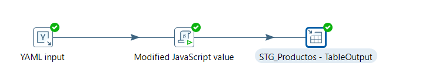
  <p style="color: #666; font-size: 0.9em; margin-top: 5px;"><i>Fig 1. Transformation Flow.</i></p>
</div>

<br/>

#### 1. Fase de Extracción Transaccional

El flujo inicia asimilando el set de datos `products_catalog.yaml`. Dado el esquema de parser nativo, resultó indispensable formatear el origen como **YAML Multi-Documento** (bloques seccionados mediante el separador estricto `---`) para proveer iteratividad. Al mandar a ejecutar el procesamiento de metadatos, el nodo Pentaho logró rastrear y tipificar correctamente la matriz extrayendo los 10 vectores dimensionales.

<div align="center">
  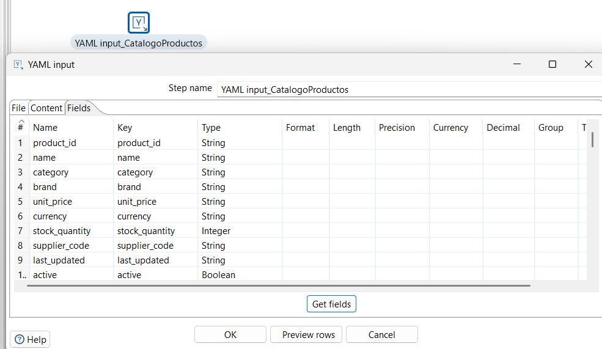
  <p style="color: #666; font-size: 0.9em; margin-top: 5px;"><i>Fig 2. YAML Input Fields.</i></p>
</div>

<br/>

#### 2. Fase de Enriquecimiento Lógico y Profiling

Se curaron las inconsistencias de origen integrando validación cruzada y casting sobre el entorno de procesamiento Rhino JavaScript Engine asimilado en PDI. Desde el algoritmo base se derivan transaccionalmente 8 nuevas columnas artificiales de control dimensional.

```javascript
/* 1. CASTING DE DATOS (Forzado numérico nativo) */
var precio_num = parseFloat(String(unit_price).trim());
var qty_num    = parseInt(String(stock_quantity));

/* 2. CÁLCULO DE MACRO-METRICAS FINANCIERAS */
var precio                 = String(precio_num.toFixed(2));
var valor_total_inventario = String((precio_num * qty_num).toFixed(2));

/* 3. SEMÁNTICA COMERCIAL E INVENTARIO */
var clasificacion_precio = precio_num > 500 ? "PREMIUM" 
                         : precio_num >= 100 ? "MID-RANGE" : "ECONOMICO";

var estado_stock = qty_num == 0 ? "SIN STOCK" 
                 : qty_num <= 20 ? "CRITICO" 
                 : qty_num <= 50 ? "BAJO" : "NORMAL";

/* 4. NORMALIZACIÓN ALFANUMÉRICA FINAL */
var estado_activo  = String(active) == "true" ? "ACTIVO" : "INACTIVO";
var categoria_norm = String(category).trim().toUpperCase();
var nombre_norm    = String(name).trim().toUpperCase();
```

<div style="background-color: #fff4e5; border-left: 4px solid #ff9800; padding: 15px; margin-top: 15px; border-radius: 4px; font-family: sans-serif;">
  <b style="color: #ed6c02;">Consideración de Integración Java:</b> Para anular la alta propensión de falla de compatibilidad sobre el motor transpilador Rhino de PDI 10.x conocida como <code>ClassCastException</code> (al mapear el tipo Javascript <i>UniqueTag</i> frente a <code>java.lang.Number</code>), todos los retornos fueron deliberadamente preformateados y casteados mediante la directiva de contención <code>String()</code>. Como requerimiento consecuente se tipificó su salida como alfanumérica pura en los campos correspondientes.
</div>

<br/>

<div align="center">
  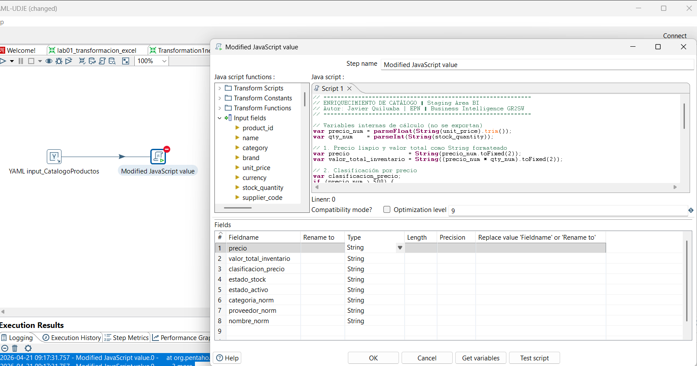
  <p style="color: #666; font-size: 0.9em; margin-top: 5px;"><i>Fig 3. JavaScript Script.</i></p>
</div>

<br/>

#### 3. Ensamblaje Estructural Secundario

Para lograr unificar el stream con mayor granularidad, el nodo medio se validó visualmente en aislamiento en una subcapa posterior (Canvas de Progreso).

<div align="center">
  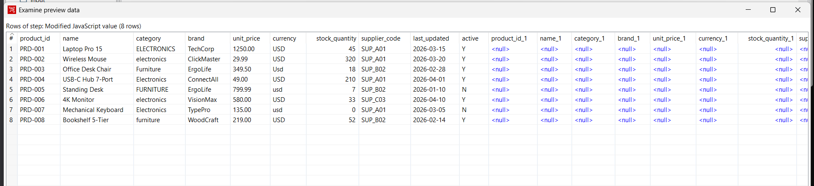
  <p style="color: #666; font-size: 0.9em; margin-top: 5px;"><i>Fig 4. Canvas Paso Medio.</i></p>
</div>

<br/>

#### 4. Fase de Transacción Persistente Relacional

Una vez estabilizada la metadata limpia en memoria, el conjunto prosigue a su persistencia física sobre la tabla parametrizada meta denominada `STG_PRODUCTOS`. Acorde a los mejores lineamientos de pruebas unitarias sobre entornos aislados (sin dependencias directas a SQL Server), se enlazó la conexión nativa JDBC apuntando hacia **Hypersonic (HSQLDB)** utilizando referenciación de URI en formato File.

<div align="center">
  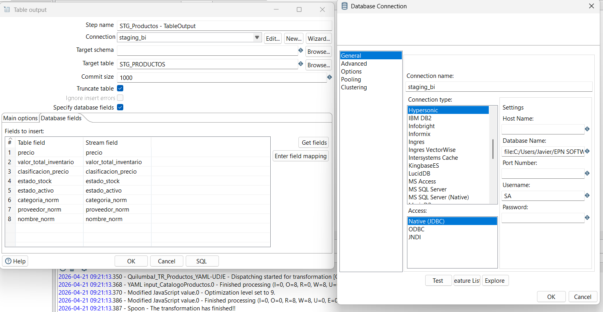
  <p style="color: #666; font-size: 0.9em; margin-top: 5px;"><i>Fig 5. Conexión BD Hypersonic.</i></p>
</div>

<br/>

Para agilizar el modelo DDL, la sentencia `CREATE TABLE` fue autogenerada de antemano garantizando el matching exacto del Buffer, declarando tipado plano equivalente acorde a los requisitos de la herramienta SQL destino.

<div align="center">
  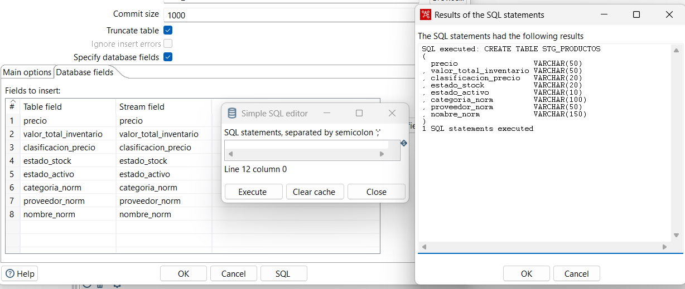
  <p style="color: #666; font-size: 0.9em; margin-top: 5px;"><i>Fig 6. SQL CREATE Table.</i></p>
</div>

<br/>

<div align="center">
  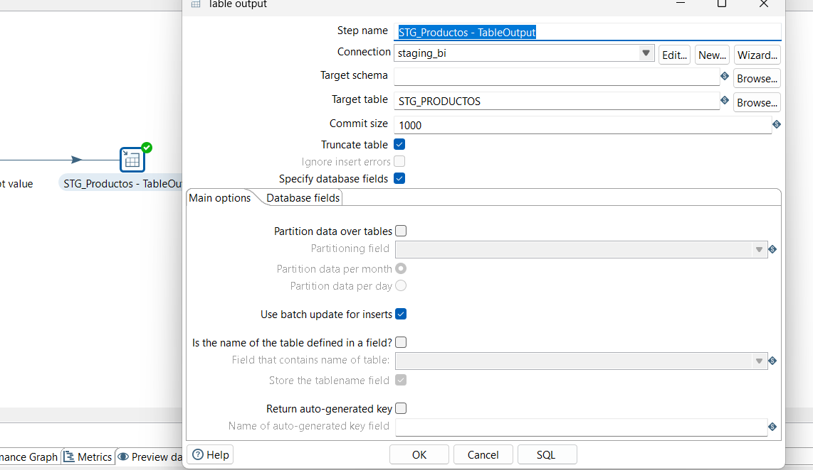
  <p style="color: #666; font-size: 0.9em; margin-top: 5px;"><i>Fig 7. Table Output Configuración.</i></p>
</div>

<br/>

#### 5. Ejecución Integral Analítica y Verificación de Estado

La fase de validación evalúa sincrónicamente la salud del proceso batch instanciando el evento de lanzamiento Run (F9). Las tabulaciones de logging validan y reportan la asimilación correcta sin presentarse un solo quiebre de lectura.

<div align="center">
  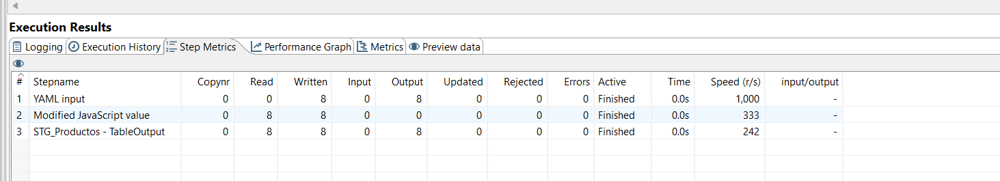
  <p style="color: #666; font-size: 0.9em; margin-top: 5px;"><i>Fig 8. Step Metrics Resultados.</i></p>
</div>

El veredicto final es evaluable mediante el visor directo de matriz. En base a los componentes previsualizados en "Preview Data", detectamos la asignación algorítmica impecable de rubros jerárquicos como categorías dinámicas (`PREMIUM`, `ECONOMICO`) e inventario sensible (ej. `SIN STOCK` o `CRITICO`). Esta capa Staging consolidada permite alimentar ahora Data Warehouses, APIs de reportería o Cubos OLAP garantizando que todas las tuplas cumplen criterios formales de Data Quality empresarial.

<div align="center">
  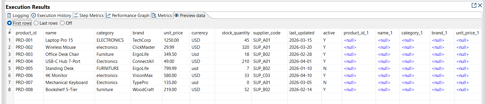
  <p style="color: #666; font-size: 0.9em; margin-top: 5px;"><i>Fig 9. Preview Data Enriquecida.</i></p>
</div>

<br/>

#### 6. Aprendizajes de este caso

<table style="width: 100%; border-collapse: collapse; font-family: sans-serif; font-size: 0.95em;">
  <thead style="background-color: #3f51b5;">
    <tr>
      <th style="padding: 10px; border: 1px solid #e0e0e0; text-align: left; width: 35%; color: #ffffff;">Aspecto Evaluado</th>
      <th style="padding: 10px; border: 1px solid #e0e0e0; text-align: left; color: #ffffff;">Aprendizaje Obtenido</th>
    </tr>
  </thead>
  <tbody>
    <tr>
      <td style="padding: 10px; border: 1px solid #e0e0e0; background-color: #fafbfc;"><b>Uso de Herramientas</b></td>
      <td style="padding: 10px; border: 1px solid #e0e0e0; background-color: #fafbfc;">Pentaho Data Integration (Spoon) facilita la creación visual de pipelines. Se aprendió a conectar archivos estructurados (YAML) e integrar lógica de validación interna con JavaScript puro.</td>
    </tr>
    <tr>
      <td style="padding: 10px; border: 1px solid #e0e0e0;"><b>Potencial de la Tecnología</b></td>
      <td style="padding: 10px; border: 1px solid #e0e0e0;">Demuestra gran utilidad práctica para Inteligencia de Negocios, ya que es capaz de migrar, homogeneizar y automatizar cargas hacia motores relacionales en pocos pasos (ej. HSQLDB).</td>
    </tr>
    <tr>
      <td style="padding: 10px; border: 1px solid #e0e0e0; background-color: #fafbfc;"><b>Ingeniería de Software</b></td>
      <td style="padding: 10px; border: 1px solid #e0e0e0; background-color: #fafbfc;">Conocer ETL amplía mi alcance técnico. Permite ir más allá de desarrollar aplicaciones y empezar a construir flujos de datos donde se limpian, refinan y preparan tablas para equipos de análisis.</td>
    </tr>
  </tbody>
</table>

---

## CONCLUSIÓN
