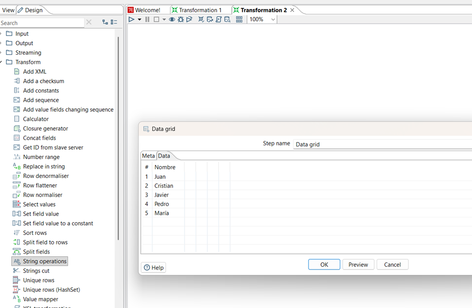
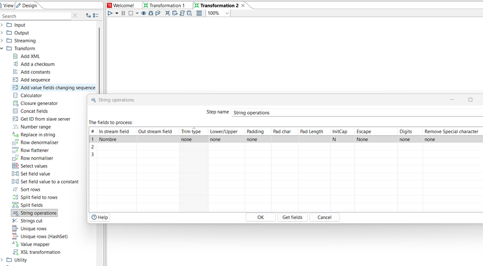
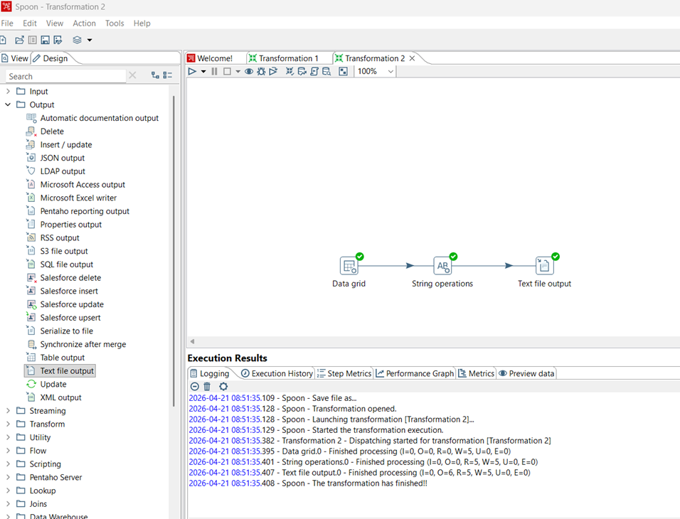
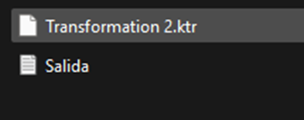
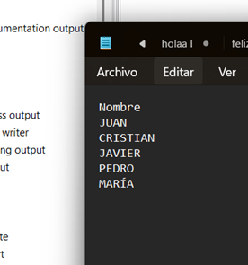

# ESCUELA POLITÉCNICA NACIONAL  
# Facultad de Ingeniería de Sistemas  
# Ingeniería de Software  
# Business Intelligence  

## Laboratorio #1  
### Instalación y uso de Pentaho Data Integration (PDI)  

**Integrantes:**  
Javier Angulo  
Jotcelyn Godoy  
Michael Tipan  
Javier Quilumba  
Cristian Robles

**Docente:**  
Diana  

**Curso:**  
Business Intelligence / GR2SW  

**Fecha:**  
21 de abril de 2026  

---

## INTRODUCCIÓN

---

## DESARROLLO
# Proceso ETL en Pentaho (JSON Input → Transformación → JSON Output)

## 1. Fase de Extracción (E)
Para iniciar el proceso, se preparó la fuente de datos y la conexión inicial en Pentaho Data Integration:

- **Preparación del origen**:  
  Se creó un archivo `.json` en el directorio local con una estructura jerárquica que incluye objetos anidados (`usuario`, `encuesta`) y campos de valor simple.

- **Configuración del Input**:  
  - Se utilizó el step **JSON Input**, renombrado como *Staging*.  
  - Se vinculó la ruta del archivo local en la pestaña **File**.  
  - En la pestaña **Fields**, se definieron los objetos y campos mediante **JsonPath** para mapear la estructura del archivo a una tabla lógica de Pentaho.

---

## 2. Fase de Transformación (T)
El objetivo fue enriquecer los datos originales mediante una calificación cualitativa basada en valores numéricos.

- **Vínculo de datos**:  
  Se creó un *hop* (conector) desde el paso *Staging* hacia el step **Number Range**.

- **Lógica de Negocio (Clasificación)**:  
  - Campo de entrada: `puntuacion_satisfaccion`  
  - Campo de salida: `rango`  
  - Umbrales definidos:

    | Límite Inferior | Límite Superior | Valor Cualitativo |
    |-----------------|-----------------|-------------------|
    | 0.0             | 5.0             | Baja              |
    | 5.0             | 8.0             | Media             |
    | 8.0             | 10.0            | Alta              |

---

## 3. Fase de Carga (L)
Finalmente, los datos transformados se exportaron a un nuevo formato para su consumo posterior.

- **Configuración de Salida**:  
  Se utilizó el step **JSON Output** conectado a la salida del **Number Range**.

- **Definición de Campos**:  
  - Se especificó el directorio de destino y el nombre del archivo de salida.  
  - En la pestaña **Fields**, se seleccionaron los campos originales junto con el nuevo campo calculado `rango`.

---

## 4. Ejecución y Validación
- **Ejecución**:  
  Se corrió la transformación mediante el botón **Run**.

- **Verificación**:  
  - Se revisaron los logs de ejecución de Spoon para confirmar que no hubo errores (`I=5, O=5`).  
  - Se validó físicamente en el directorio que el archivo JSON de salida contuviera la nueva etiqueta cualitativa por cada registro procesado.

---
# Proceso ETL en Pentaho (Data Grid Input → Transformación → Text file Output)

## 2. Input: Data Grid
Para el experimento de entrada, se utilizó el componente Data Grid. Este paso permite generar una tabla de datos interna sin necesidad de archivos externos.

* **Configuración:** Se definió una columna de tipo `String` denominada `Nombre`.
  
  

* **Datos ingresados:** Se registraron 5 filas con nombres propios (Cristian, Javier, Juan, Pedro y Pepito).

    

## 2. Transformation: String Operations
Como transformación, se aplicó el componente **String Operations** para demostrar la capacidad de Pentaho en la normalización de cadenas de texto.

* **Configuración:** Se seleccionó el campo `Nombre` y se aplicó la función **Upper** para poner todas las letras en Mayúsculas.
* **Limpieza:** Se activó la opción **Trim type: both** para asegurar la eliminación de espacios en blanco innecesarios, garantizando la integridad de los datos.

---

## 3. Output: Text File Output
Para cerrar el ciclo del proceso ETL, se utilizó un componente de salida de archivos de texto plano.

* **Función:** Exportar los datos ya transformados a un archivo físico.
* **Resultado:** El archivo final contiene los nombres procesados y estandarizados, listos para ser consumidos por otros módulos de software o sistemas de reportería.

---

## 4. Resultados de Ejecución
Se procedió a correr la transformación localmente en Spoon. El sistema reportó una ejecución exitosa de extremo a extremo.

* **Estado:** Finalización exitosa (Checks verdes en todos los componentes).
* **Métricas:** Se procesaron correctamente las 5 filas de entrada, pasando por la transformación y llegando al archivo de salida sin pérdida de datos.

---

## CONCLUSIÓN
